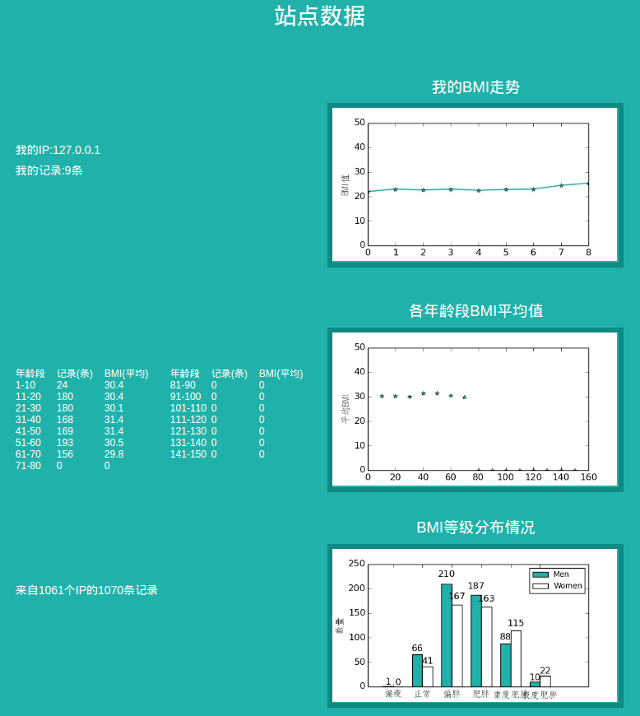

# 基于Django的BMI指数计算应用

* * *

##### 作者：[JeffyLu](https://jeffylu.github.io)

* * *

## 一、简介
&emsp;&emsp;本站主要由python和django搭建而成，具有BMI指数计算、等级分析、记录查询、数据统计等功能。

## 二、环境依赖
- Python 3.4
- Django 1.10.1
- Matplotlib
- Numpy

## 三、安装
**1. 具备上述环境依赖后在根目录下进入终端，输入以下命令迁移数据库（ubuntu中可能用python3替换python）**
```
$python manage.py makemigrations
$python manage.py migrate
```

**2. 创建后台管理员用户**
```
$python manage.py createsuperuser
```
**3. 启动服务**
- 本地服务
```
$python manage.py runserver
```
- 局域网共享
```
$python manage.py runserver 0.0.0.0:8000
```
- ***由于存在部分bug，推荐关闭多线程启动服务***
```
$python manage.py runserver --nothreading
```

## 四、具体功能应用
**1. 计算BMI**    

&emsp;&emsp;用户可在右侧填写年龄、性别、身高、体重进行计算，计算后右侧会显示最新的5条记录和健康等级。    


- - -

**2. 站点数据统计**    

&emsp;&emsp;此页可跟踪个人BMI走势，分析各年龄段BMI均值，健康等级分布情况等功能。    



- - -
**3. 健康之家**    

&emsp;&emsp;提供了几个健康社区    


- - -
**4. 后台管理**    

&emsp;&emsp;后台入口"/admin"，用户名和密码为第三点中所创的。可对每项数据进行批量修改等操作。        


- - -
**5. 其他**    

&emsp;&emsp;凡在后台被设为黑名单的ip将无法提交数据。另外隐藏一个"/add"入口用于批量添加随机数据。    

***注：每个IP对应一个用户***
## 五、写在最后
若发现bug请在issue中提出，欢迎参与维护。    
联系方式:    
- QQ:367188060
- 邮箱:JeffyLu@gmail.com
- 个人主页:[Jeffy's Personal Page](https://jeffylu.github.io)